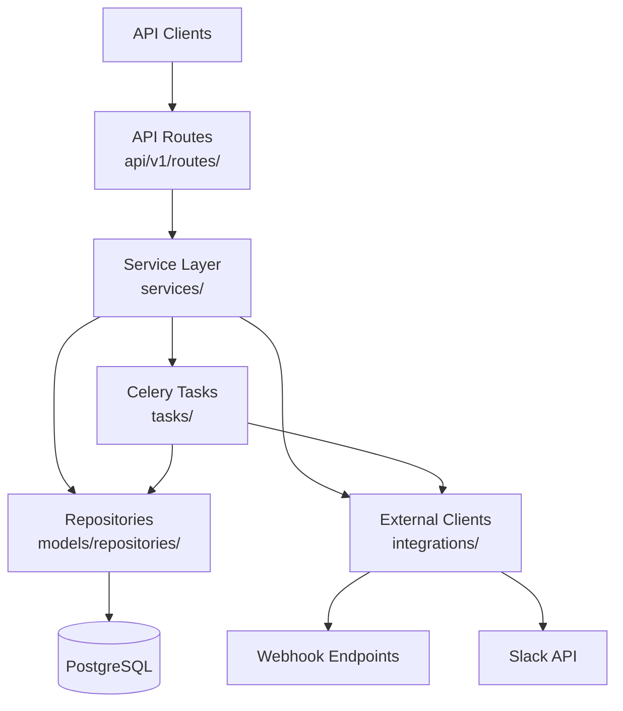
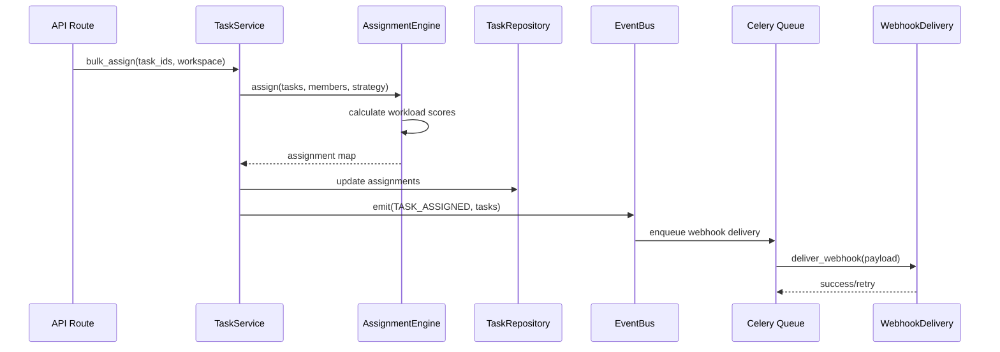
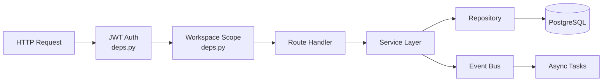

# Example Output

This is an example of a generated `docs/CODEBASE.md` at **Standard depth** for a
medium-complexity Python web service. Inline comments (`<!-- ... -->`) explain what
was EXCLUDED and why — these comments would not appear in real output.

Use this to calibrate your output quality. The example is ~295 lines for a project
with 45+ source files, 12+ dependencies, and moderate architectural complexity.

---

# TaskFlow API

> Task management REST API with real-time webhook notifications, team workspaces,
> and automated task assignment based on workload balancing.

- **Type:** Web service (REST API)
- **Primary language:** Python 3.12
- **Key frameworks:** FastAPI 0.115.x, SQLAlchemy 2.0.x, Celery 5.4.x
- **Status:** Active development — 4 contributors, 18 months old

<!-- EXCLUDED: "Built with Python" — obvious from frameworks listed -->
<!-- EXCLUDED: 3-paragraph project history — doesn't help a new dev get productive -->
<!-- EXCLUDED: "Uses REST architecture" — FastAPI implies this -->

## Contents

- [Architecture Overview](#architecture-overview)
- [Project Structure](#project-structure)
- [Key Components](#key-components)
- [Data Flow](#data-flow)
- [External Integrations](#external-integrations)
- [Development Guide](#development-guide)
- [Critical Paths & Gotchas](#critical-paths--gotchas)

## Architecture Overview

Three-layer architecture: thin API routes delegate to service classes, which orchestrate
repository calls and external integrations. Celery handles async work (webhook delivery,
workload recalculation). The separation was introduced after route handlers grew past 200
lines — services own all business logic, routes handle only HTTP request/response mapping.

### System Diagram



<!-- EXCLUDED: Detailed box descriptions for each component — the code is self-explanatory -->

### Design Patterns
- **Repository pattern**: All DB access goes through repository classes in
  `models/repositories/`. Services never use `session.execute()` directly.
- **Strategy pattern for assignment**: `services/assignment.py` defines
  `AssignmentStrategy` base class. Three implementations: round-robin, workload-based,
  and manual. Selected via workspace configuration.
- **Event-driven webhooks**: Task state changes emit events via `core/events.py` →
  `EventBus`. Celery workers consume events and deliver webhooks with retry logic.

### Key Architectural Decisions
- **Celery over BackgroundTasks**: Webhook delivery can take 5-30 seconds (retries +
  slow endpoints). FastAPI BackgroundTasks would block workers. Celery provides proper
  retry, dead letter queues, and Flower monitoring.
- **Workspace isolation**: All queries are scoped to workspace via `get_workspace_scope()`
  in `api/deps.py`. This is a security boundary — bypassing it leaks data across
  workspaces.

<!-- EXCLUDED: "Why REST over GraphQL" — standard choice, not surprising -->
<!-- EXCLUDED: "Why PostgreSQL" — industry default, no explanation needed -->

## Project Structure

```
src/taskflow/
├── main.py                  → FastAPI app factory, middleware, lifespan
├── api/
│   ├── deps.py              — dependency injection (DB session, auth, workspace scope)
│   └── v1/routes/           — one file per resource (tasks, workspaces, users, webhooks)
├── services/                — business logic, one per domain
│   ├── tasks.py             — task CRUD + state machine
│   ├── assignment.py        — workload balancing + assignment strategies
│   └── webhooks.py          — webhook registration + payload construction
├── models/
│   ├── db/                  — SQLAlchemy ORM models (Task, Workspace, User, Webhook)
│   ├── schemas/             — Pydantic request/response schemas
│   └── repositories/        — data access layer (one repo per model)
├── tasks/                   — Celery task definitions
│   ├── webhook_tasks.py     — async webhook delivery with retry
│   └── assignment_tasks.py  — periodic workload recalculation
├── integrations/
│   └── slack_client.py      — Slack notification wrapper
├── core/
│   ├── config.py            — pydantic-settings, all config via env vars
│   ├── events.py            — internal event bus for state change notifications
│   └── exceptions.py        — domain exceptions → HTTP error mapping
└── migrations/              — Alembic (backwards-compatible only)
```

<!-- EXCLUDED: tests/ directory — standard pytest mirror structure, nothing unusual -->
<!-- EXCLUDED: Individual __init__.py files — boilerplate -->

## Key Components

### Task Service
**Location:** `src/taskflow/services/tasks.py`
**Purpose:** Manages the full task lifecycle from creation to completion
**Key files:**
- `tasks.py` — `TaskService` class, all task operations
- `tasks.py` — `transition_state()` — enforces the task state machine
  (OPEN → IN_PROGRESS → REVIEW → DONE/BLOCKED). Backward transitions only allowed
  for BLOCKED → OPEN.
- `tasks.py` — `bulk_assign()` — delegates to AssignmentStrategy, emits events
  for webhook delivery

All state changes must go through `transition_state()`. Direct `task.status = X`
bypasses validation, event emission, and audit logging. See
`tests/services/test_tasks.py` for state transition edge cases.

### Assignment Engine
**Location:** `src/taskflow/services/assignment.py`
**Purpose:** Distributes tasks across team members based on configurable strategies
**Key files:**
- `assignment.py` — `AssignmentStrategy` ABC with three implementations
- `assignment.py` — `WorkloadStrategy` — weighs task priority and current load
- `assignment.py` — `get_strategy()` — factory, reads strategy from workspace config

Strategy is configured per-workspace in `workspace.assignment_strategy` field.
Adding a new strategy: implement `AssignmentStrategy`, register in `get_strategy()`.

### Webhook System
**Location:** `src/taskflow/services/webhooks.py` + `src/taskflow/tasks/webhook_tasks.py`
**Purpose:** Delivers real-time notifications to external systems when task state changes
**Key files:**
- `webhooks.py` — `WebhookService` — registration, payload construction, signature generation
- `webhook_tasks.py` — `deliver_webhook()` — Celery task with exponential backoff
  (3 retries, 30s/60s/120s delays). HMAC-SHA256 signature in `X-TaskFlow-Signature` header.
- `core/events.py` — `EventBus` — in-process pub/sub that connects state changes to
  webhook delivery

<!-- EXCLUDED: Full list of all 15 models — only the architecturally significant ones matter -->
<!-- EXCLUDED: Utility functions in utils/ — standard helpers, self-documenting -->

### Component Interaction — Task Assignment Flow



## Data Flow

Requests enter through FastAPI routes, which extract workspace context from JWT tokens
via `api/deps.py`. Routes delegate to services, which coordinate between repositories
(DB access) and integrations (external APIs). State changes trigger events that Celery
workers process asynchronously.

### Request Lifecycle



### Key Data Transformations
- HTTP request body → Pydantic schema (`models/schemas/`) → validated domain object
- Domain object → SQLAlchemy model (`models/db/`) → database row
- State change event → webhook payload (`webhooks.py` → `build_payload()`) → signed HTTP POST to subscriber

## External Integrations

| Service | Purpose | Client Location | Auth Method |
|---------|---------|----------------|-------------|
| PostgreSQL | Primary data store | `models/repositories/` | Connection string via `DATABASE_URL` |
| Redis | Celery broker + result backend | `core/config.py` | `REDIS_URL` env var |
| Slack API | Team notifications | `integrations/slack_client.py` | Bot token via `SLACK_BOT_TOKEN` |

### Configuration
All external service config via environment variables. Pydantic-settings loads and
validates them in `core/config.py`. No config files, no CLI args. Required vars are
documented in `.env.example`.

<!-- EXCLUDED: "PostgreSQL is a relational database" — everyone knows -->
<!-- EXCLUDED: Detailed Slack API documentation — read Slack docs for that -->

## Development Guide

### Prerequisites
- Python 3.12+
- PostgreSQL 16+
- Redis 7+

### Getting Started
```bash
python -m venv .venv && source .venv/bin/activate
pip install -e ".[dev]"             # from pyproject.toml
cp .env.example .env                # configure DATABASE_URL, REDIS_URL
alembic upgrade head                # run migrations
uvicorn src.taskflow.main:app --reload
```

### Key Commands
| Command | Purpose |
|---------|---------|
| `make test` | Run full test suite (pytest) |
| `make test-fast` | Run tests without slow integration tests |
| `make lint` | Run ruff linter |
| `make format` | Auto-format with ruff |
| `make typecheck` | Run mypy in strict mode |
| `make migrate MSG="description"` | Create new Alembic migration |
| `make worker` | Start Celery worker for async tasks |

### Testing
pytest with 80% coverage enforced. Tests mirror `src/` structure. Integration tests
(marked `@pytest.mark.integration`) hit a real test database — no mocking of DB in
integration tests. Run `make test-fast` to skip them during development.

### Configuration
Copy `.env.example` to `.env`. Required variables:
- `DATABASE_URL` — PostgreSQL connection string
- `REDIS_URL` — Redis connection string
- `SECRET_KEY` — JWT signing key (generate with `openssl rand -hex 32`)

Optional: `SLACK_BOT_TOKEN`, `LOG_LEVEL`, `CELERY_CONCURRENCY`.

See `CONTRIBUTING.md` for branch naming conventions and PR workflow.

## Critical Paths & Gotchas

### Areas Requiring Extra Caution
- **Task state machine** (`services/tasks.py` → `transition_state()`): State transitions
  have strict rules. Direct status assignment bypasses validation and audit logging.
- **Workspace scoping** (`api/deps.py` → `get_workspace_scope()`): Every query must be
  scoped to the current workspace. Forgetting it leaks data across workspaces.
- **Webhook signatures** (`services/webhooks.py` → `sign_payload()`): HMAC-SHA256 with
  workspace-specific secret. Changing the algorithm breaks all existing webhook consumers.

### Common Mistakes
- **Migrations with non-nullable columns**: Zero-downtime deploys mean old code runs
  alongside new migrations. Always add columns as nullable, backfill, then add
  constraint in a follow-up migration. (Two incidents in git history: `a3f2e1d`, `8b4c7f2`)
- **Committing inside services**: Services should never call `session.commit()` —
  transaction boundaries are managed by the route-level dependency in `deps.py`.
  Committing mid-service breaks the unit-of-work pattern.
- **Hardcoding workspace IDs in tests**: Use the `workspace_factory` fixture from
  `tests/conftest.py` instead.

### Where to Start
Recommended reading order for a new developer:
1. `src/taskflow/main.py` — app factory, see how middleware and routes are wired up
2. `src/taskflow/api/deps.py` — dependency injection system, auth, workspace scoping
3. `src/taskflow/services/tasks.py` — core business logic, state machine
4. `src/taskflow/core/events.py` — how state changes propagate to async handlers
5. `tests/conftest.py` — test fixtures, how to write new tests

---
<!-- USER NOTES - content below this line is preserved on updates -->

## Additional Notes

[Space for team members to add domain context, corrections, or supplementary notes.
This section is never overwritten by automated updates.]
