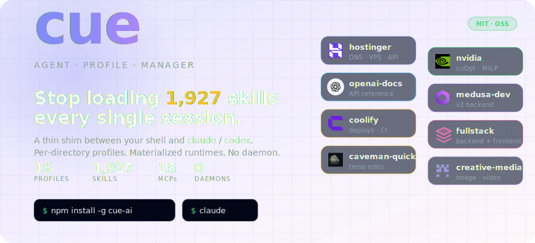
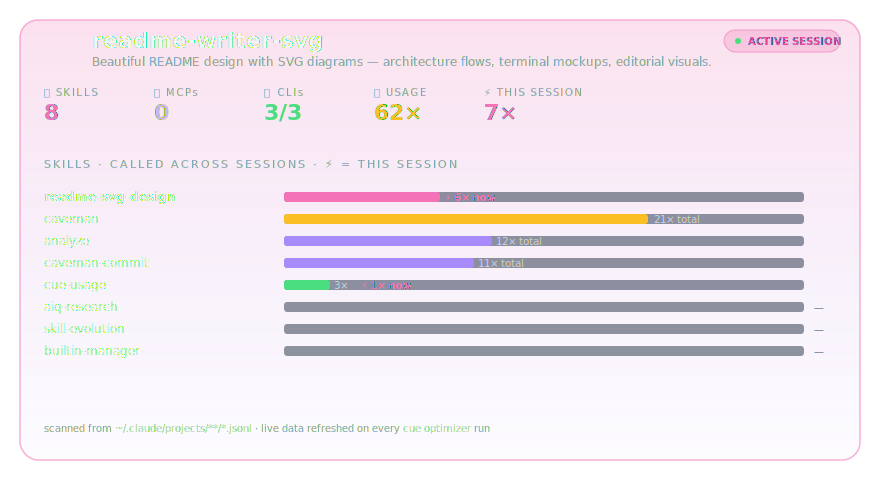

<p align="center">
  
</p>

<p align="center">
  <a href="https://www.npmjs.com/package/cue-ai"></a>
  <a href="https://www.npmjs.com/package/cue-ai"></a>
  <a href="https://github.com/recodeee/cue/stargazers"></a>
  <a href="https://github.com/recodeee/cue/commits/main"></a>
  <a href="./LICENSE"></a>
</p>

# cue — Agent Profile Manager for Claude Code & Codex

> Every `claude` session loads all **1,927** skills you've ever installed. Your model picks the wrong one. Your tokens evaporate. **cue fixes this in one command.**

## ⚡ 60-second quickstart

```bash
npm install -g cue-ai                          # 1. install
cd ~/projects/q4-launch && echo marketing > .cue-profile   # 2. pin a profile to this repo
claude                                         # 3. boots with only the marketing loadout
```

That's it. `cd` into any other repo and `claude` will boot with that repo's profile instead — no flags, no env vars, no daemon.

<p align="center">
  
</p>

> **No GIF yet?** Generate it with [`vhs`](https://github.com/charmbracelet/vhs): `vhs docs/demo.tape` → writes `docs/assets/demo.gif`.

<details>
<summary>📑 <b>Table of contents</b></summary>

- [Why a profile manager at all?](#why-a-profile-manager-at-all)
- [How cue compares](#how-cue-compares)
- [How it works](#how-it-works)
- [`cue optimizer` — see every loadout at a glance](#cue-optimizer--see-every-loadout-at-a-glance)
- [The 16-profile catalog](#the-16-profile-catalog)
- [Install](#install)
- [What ships with each profile](#what-ships-with-each-profile-the-lean-stack)
- [FAQ](#faq)
- [Repo layout](#repo-layout)
- [Built with / built on](#built-with--built-on)
- [Contributing](#contributing)

</details>

---

## Why a profile manager at all?

<p align="center">
  
</p>

- **Per-profile isolation.** Skills, MCP servers, and Claude Code plugins are scoped to the active profile. Marketing work doesn't see frontend's MCPs; backend doesn't see design's skills. No more "every session has every tool" overload.
- **Directory-aware.** Pin a profile to a directory (`.cue-profile`), and every `claude` / `codex` you launch from inside boots with that loadout automatically. No flag wrangling.
- **Composable.** Profiles inherit from a `core` baseline so cross-session memory (claude-mem) and meta skills are shared by default. Add team-wide tools in one place.
- **Pre-launch picker.** First time you type `claude` in a fresh directory, a TUI picker opens. Pin or one-shot — your choice.
- **Materialized, hash-short-circuited.** Each launch rebuilds the runtime only when the resolved profile actually changed. Cold-start cost is a `stat()` + sha256 compare.
- **No service to run.** No daemon, no background process, no auto-update. Just a Bun CLI and a shim script in `~/.local/bin`.

---

## How cue compares

Several tools touch parts of the problem — switching MCP configs, distributing skills, installing from marketplaces. **cue is the only one that treats the full agent loadout (skills + MCPs + plugins) as a composable, inheritable, directory-aware profile system.**

| Tool | What it does | What cue does that it doesn't |
|---|---|---|
| [`claude-code-switcher`](https://github.com/search?q=claude-code-switcher) | Switches MCP configs + auth between Claude Code profiles | Skill scoping · profile inheritance · materialized isolated runtimes |
| [`skillport`](https://github.com/search?q=skillport) | Serves skills to any agent via CLI/MCP | Per-directory `.cue-profile` pinning · profile system, not just skill delivery |
| [`agent-skills-cli`](https://github.com/search?q=agent-skills-cli) | Browses 40k+ skills from the SkillsMP marketplace | Profile-level isolation · no all-or-nothing global install |
| [`agent-skill-manager`](https://pypi.org/project/agent-skill-manager/) | PyPI installer for AI agent skills across platforms | Profile concept · directory-aware switching |
| [`skillshub`](https://github.com/search?q=skillshub) | "Homebrew for AI Agent Skills" | Materialized per-profile runtimes · inheritance chains |
| [`add-skills`](https://github.com/search?q=add-skills) | Python CLI for add/remove of skills | Multi-dimension loadout (skills + MCPs + plugins together) |
| **Kiro Powers** | Context-aware MCP loading inside the Kiro IDE | Standalone CLI · works with **any** terminal, **any** project, both Claude Code & Codex |

**Where cue is the only one:**

1. **`.cue-profile` per-directory pinning** — `cd` into a repo, the right loadout loads automatically.
2. **Materialized isolation** — builds a real `CLAUDE_CONFIG_DIR` per profile, not just a config swap.
3. **Hash-cached rebuilds** — content-addressed sha256 check, <5 ms when unchanged.
4. **Three dimensions as one unit** — skills + MCPs + plugins composed together. Others manage one at a time.
5. **Inheritance with merge semantics** — `core → backend → medusa-dev` chains; child overrides parent cleanly.
6. **Shim-based interception** — type `claude` like always. The right environment just shows up.
7. **No daemon** — pure CLI, no background process, nothing to monitor.
8. **`cue optimizer` dashboard** — visual audit of every profile's loadout, install status, and per-skill usage scanned from your actual session transcripts.

---

## How it works

<p align="center">
  
</p>

Typing `claude` or `codex` in a repo where cue's shims are installed triggers a three-step launch flow:

1. **Resolve** — cue checks for a `.cue-profile` file in the current directory (or any parent up to `$HOME`). If none is found, it falls back to a repo-level default, a global default, or opens the TUI picker.
2. **Materialize** — cue builds `~/.config/cue/runtime/<profile>/{claude,codex}/` with a content-addressed hash check. If the profile hasn't changed, this is a no-op.
3. **Exec** — the real `claude` or `codex` binary is launched with `CLAUDE_CONFIG_DIR` (or `CODEX_HOME`) pointing at the materialized runtime tree.

Full resolve-precedence rules and bypass paths: **[docs/launch.md](./docs/launch.md)**.

---

## `cue optimizer` — see every loadout at a glance

Run it once and you get a dashboard of every profile: skills (with per-session usage), MCP servers, required CLIs (with install status ✅/❌), GitHub sources, and brand icons.

<p align="center">
  
</p>

What the optimizer scans for you:

- Every `profile.yaml` (inheritance resolved, `*` wildcards expanded)
- Each skill's frontmatter for `allowed-tools` and `## Prerequisites` → required CLIs
- `which <cli>` for every CLI → install status per profile
- `~/.claude/projects/**/*.jsonl` → per-skill usage counts across all sessions
- `~/skills-lock.json` → which GitHub repo each skill came from

### Terminal output

<p align="center">
  
</p>

```bash
cue optimizer                 # all profiles
cue optimizer backend         # just one
cue optimizer --expand        # expand grouped skills (useful for cybersecurity's 754)
```

### A single profile, expanded

<p align="center">
  
</p>

Each card shows what's actually loaded *plus* how often you've reached for each skill. The bar chart is computed from your local session transcripts — no telemetry leaves the machine.

---

## The 16-profile catalog

<p align="center">
  
</p>

```bash
cue list                      # show all
cue use medusa-dev            # pin to current directory
claude                        # launches with medusa-dev's loadout
```

---

## Install

```bash
npm install -g cue-ai
```

That's it. Then in any project:

```bash
cd ~/projects/q4-launch
echo marketing > .cue-profile
claude
```

**Other install paths** (pick what you prefer):

| Path | Command |
|---|---|
| **One-line script** | `curl -fsSL https://raw.githubusercontent.com/recodeee/cue/main/get.sh \| bash` |
| **Manual clone** | `git clone https://github.com/recodeee/cue.git ~/Documents/cue && ~/Documents/cue/install.sh` |
| **Per-OS bootstrap (agent-driven)** | paste [`setup/macos.md`](./setup/macos.md) · [`setup/linux.md`](./setup/linux.md) · [`setup/windows.md`](./setup/windows.md) into Claude Code |

`install.sh --help` lists `--yes`, `--codex`, `--uninstall`. Idempotent — safe to re-run.

---

## What ships with each profile (the lean stack)

| Layer | What it does |
|---|---|
| **claude-mem** plugin | Passive observation capture; `mem-search "topic"` recalls across sessions |
| **caveman** plugin | `/caveman` terse mode, `/caveman-commit` Conventional Commits |
| **RTK** CLI hook | Filters shell output — 60-90% token savings on `ls` / `git` / `cat` |
| **gbrain** MCP | Personal wiki with embeddings + backlinks |
| **excel-mcp** / **word-mcp** | Native `.xlsx` / `.docx` read & write |

Want to **run 2+ agents in parallel on one repo**? Layer the optional **Colony + gitguardex** tier — see [`setup/parallel-agents.md`](./setup/parallel-agents.md). Skip it for solo work.

---

## FAQ

<details>
<summary><b>Why not just use <code>~/.claude/</code> like everyone else?</b></summary>

That's exactly the problem cue solves. `~/.claude/` is one global folder shared across every repo, so every session loads every skill, every MCP, and every plugin you've ever installed. The model burns tokens picking through irrelevant tools and frequently picks the wrong one. cue gives each project its own isolated `CLAUDE_CONFIG_DIR` materialized just-in-time — only what that project needs.
</details>

<details>
<summary><b>Does this break Claude Code's auto-update?</b></summary>

No. cue doesn't touch the `claude` binary — it just intercepts the *call*, sets `CLAUDE_CONFIG_DIR`, and execs the real binary at the end of the shim. Claude Code's update mechanism still runs the same way.
</details>

<details>
<summary><b>Can I use cue with only Codex (no Claude Code)?</b></summary>

Yes. Run `cue shell install --codex-only` (or skip the `claude` shim during interactive install). cue scopes resources per-agent in `profile.yaml`, so a Codex-only profile only materializes `CODEX_HOME`.
</details>

<details>
<summary><b>What if I only want one global profile and never want to think about this?</b></summary>

Set a global default with `cue use <profile> --global`. cue will use it for every directory that doesn't have its own `.cue-profile`. The picker stops appearing.
</details>

<details>
<summary><b>Is this a daemon or background service?</b></summary>

No. cue is a pure CLI — when you type `claude`, the shim runs `cue launch`, which does a `stat()` + sha256 compare, materializes the runtime if anything changed (else no-op), and then `exec`s the real binary. Nothing stays resident. Nothing to monitor. Nothing to `systemctl restart`.
</details>

<details>
<summary><b>How fast is the launch overhead?</b></summary>

Cold start (first launch of a new profile): typically 50–200 ms depending on how many skills + MCPs are linked. Warm start (profile unchanged): &lt;5 ms — just a sha256 compare and an `exec`. Both are imperceptible vs. Claude Code's own startup.
</details>

<details>
<summary><b>Does cue send telemetry anywhere?</b></summary>

No. Everything cue computes (including the per-skill usage bars in `cue optimizer`) is read from your local `~/.claude/projects/**/*.jsonl` session transcripts. Nothing leaves the machine.
</details>

<details>
<summary><b>What does cue NOT do?</b></summary>

- It does not modify or repackage the Claude Code / Codex binary.
- It does not host a remote skill marketplace — skills live in your repo or come from [open-source sources](#built-with--built-on).
- It does not coordinate multi-agent runs (that's [`recodeee/colony`](https://github.com/recodeee/colony) + [`gitguardex`](https://github.com/recodeee/gitguardex), layered on top via the parallel-agents tier).
- It does not auto-pick a profile from repo contents — you pin once with `echo <profile> > .cue-profile`. (A scan-to-profile flow is on the roadmap.)

</details>

---

## Repo layout

```
cue/
├── profiles/        one dir per profile, YAML decides what loads (inheritance, agent scoping)
├── resources/
│   ├── skills/      110+ local skills (medusa, codex-fleet, higgsfield, caveman, …)
│   ├── mcps/        MCP server configs (claude.sanitized.json, codex.sanitized.json)
│   └── icons/       brand icons used in the optimizer dashboard
├── plugins/cue/     the Claude Code plugin: /cue, /cue switch, /cue reload, /cue current
├── src/             the Bun CLI — commands/{optimizer,launch,picker,…}, lib/runtime-materializer
├── setup/           paste-into-agent install prompts (macos, linux, windows, parallel-agents)
└── docs/            launch.md, shell-install.md, assets/ (the SVGs in this README)
```

Full docs: **[docs/launch.md](./docs/launch.md)** (resolve → materialize → exec flow) · **[docs/profiles/](./docs/profiles/)** (schema, inheritance, scan-to-profile, troubleshooting) · **[AGENTS.md](./AGENTS.md)** (bootstrap contract for AI agents).

---

## Built with / built on

cue glues together a small set of excellent open-source projects. Star counts are live from GitHub.

**Runtime & dependencies (the CLI itself):**

| Project | What we use it for | |
|---|---|---|
| [oven-sh/bun](https://github.com/oven-sh/bun) | TypeScript runtime that ships `bin/cue` | [](https://github.com/oven-sh/bun) |
| [natemoo-re/clack](https://github.com/natemoo-re/clack) | `@clack/prompts` powers the TUI profile picker | [](https://github.com/natemoo-re/clack) |
| [ajv-validator/ajv](https://github.com/ajv-validator/ajv) | JSON Schema validation for `profile.yaml` | [](https://github.com/ajv-validator/ajv) |
| [eemeli/yaml](https://github.com/eemeli/yaml) | YAML parsing for profile definitions | [](https://github.com/eemeli/yaml) |

**Built-in terminal integration:**

| Project | What we use it for | |
|---|---|---|
| [kovidgoyal/kitty](https://github.com/kovidgoyal/kitty) | **Kitty graphics protocol** — inline brand logos & profile icons rendered directly in the terminal (see [`src/lib/kitty-image.ts`](./src/lib/kitty-image.ts), spec [here](https://sw.kovidgoyal.net/kitty/graphics-protocol/)). Auto-detected; falls back to emoji if you're not on Kitty. | [](https://github.com/kovidgoyal/kitty) |

**Agents we shim:**

| Project | Role | |
|---|---|---|
| [anthropics/claude-code](https://github.com/anthropics/claude-code) | The `claude` binary cue intercepts and re-launches with `CLAUDE_CONFIG_DIR` | [](https://github.com/anthropics/claude-code) |
| [openai/codex](https://github.com/openai/codex) | The `codex` binary cue intercepts and re-launches with `CODEX_HOME` | [](https://github.com/openai/codex) |

**Skill packs & sister tools:**

| Project | Role | |
|---|---|---|
| [mukul975/Anthropic-Cybersecurity-Skills](https://github.com/mukul975/Anthropic-Cybersecurity-Skills) | 754 cybersecurity skills (red/blue team, forensics, DFIR) loaded by the `cybersecurity` profile | [](https://github.com/mukul975/Anthropic-Cybersecurity-Skills) |
| [recodeee/colony](https://github.com/recodeee/colony) | Local-first MCP for multi-agent coordination — used by the `fleet-control` profile | [](https://github.com/recodeee/colony) |
| [recodeee/gitguardex](https://github.com/recodeee/gitguardex) | `gx` CLI for branch + worktree isolation when running 2+ agents on one repo | [](https://github.com/recodeee/gitguardex) |
| [rtk-ai/rtk](https://github.com/rtk-ai/rtk) | Token-savings hook on shell output (60–90% reduction on `ls`/`git`/`cat`) | [](https://github.com/rtk-ai/rtk) |
| [astral-sh/uv](https://github.com/astral-sh/uv) | Python venv manager used by `setup/<os>.md` to run uvx-based MCP servers (Excel / Word) | [](https://github.com/astral-sh/uv) |

Plus the **brand logos** you see in the optimizer dashboard and hero come from each vendor's official press kit (OpenAI, NVIDIA, Hostinger, Coolify, Medusa, Stripe, Higgsfield, Obsidian) — see [`resources/icons/`](./resources/icons/).

---

## Contributing

Each skill is a folder with `SKILL.md` (frontmatter + body). The frontmatter `description` is what the LLM matches against — write it as `"when user says X, do Y"`. Copy an existing skill as a template, drop it under `resources/skills/skills/<category>/<slug>/`, and the catalog regenerates on the next sync.

The SVGs in this README live in [`docs/assets/`](./docs/assets/) — edit the XML directly or regenerate from the `readme-writer` profile.

License: [MIT](./LICENSE).
