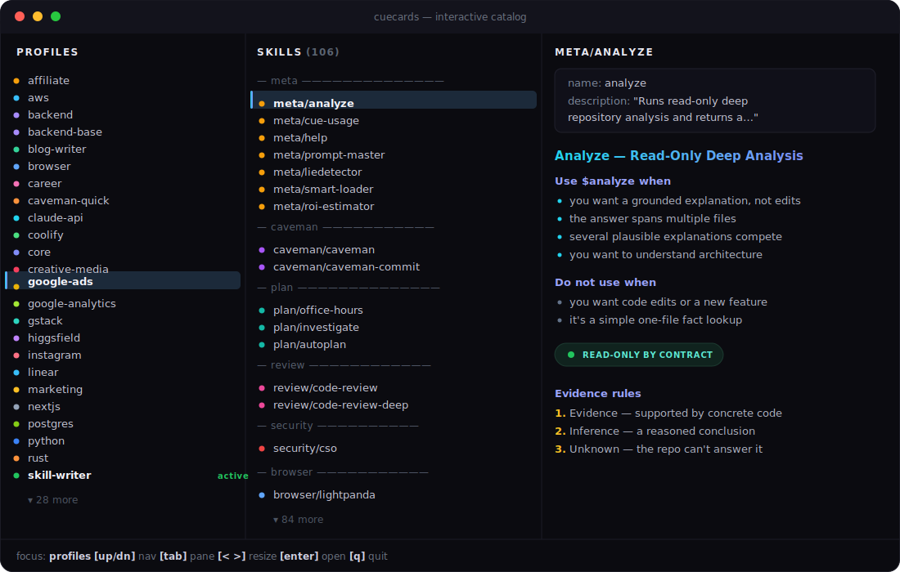

<br>

<p align="center">
  
</p>

<br>

<h1 align="center">cuecards.</h1>

<p align="center">
  <strong>The missing layer between you and your coding agent.</strong>
</p>

<p align="center">
  <sub>Your agent walks into a directory. The cuecard tells it who to be — and loads only what the job needs.</sub>
</p>

<br>

<p align="center">
  <a href="https://www.npmjs.com/package/cue-ai"></a>&nbsp;
  <a href="https://www.npmjs.com/package/cue-ai"></a>&nbsp;
  <a href="https://github.com/opencue/cuecards/stargazers"></a>&nbsp;
  <a href="./LICENSE"></a>&nbsp;
  
</p>

<br>

<p align="center">
  <code>npm install -g cue-ai</code>
</p>

<p align="center">
  <sub>Requires Node ≥20 and an existing <a href="https://github.com/anthropics/claude-code">Claude Code</a> or <a href="https://github.com/openai/codex">Codex</a> install — cue is a thin shim that exec's your agent, not a replacement.</sub>
  <br>
  <sub>package <code>cue-ai</code> &nbsp;·&nbsp; command <code>cue</code> &nbsp;·&nbsp; repo <a href="https://github.com/opencue/cuecards"><code>opencue/cuecards</code></a></sub>
</p>

<br>
<br>

---

## the problem.

You installed 330 skills and 15 MCP servers. Your agent re-reads **every one of them, on every message** — including the 320 it doesn't need for the task in front of it.

You pay for that context on every single turn. And the model gets *worse* at picking the right tool, because it's scanning a wall of irrelevant descriptions before it can act.

**cuecards loads only the cuecard for the directory you're in.** One project's skills, MCPs, persona, and gates — not your entire library. Less context, lower cost, sharper tool selection.

<br>

---

## the money shot.

> Loading everything taxes every message. cuecards cut your always-on context **~9–16×** — and you can reproduce every number below with `cue cost --compare`.

| Loadout | Always-on context | Cost / 100 msgs (Sonnet input) |
|---|---|---|
| **Without cuecards** — `full` (every skill + MCP) | ~81k tokens | ~$24 😱 |
| **With cuecards** — `backend` profile | ~9k tokens | ~$2.70 ✅ |
| **With cuecards** — `caveman-quick` | ~6.8k tokens | ~$2.00 🚀 |

That's **~9× fewer always-on tokens** on a backend loadout (≈12× on `caveman-quick`, up to ≈16× on the leanest profiles) versus loading everything. The savings compound on every message of every session.

```bash
cue cost                      # token budget for your active profile
cue cost --compare            # full table: every profile ranked vs the `full` baseline
```

<p align="center">
  <sub><strong>&lt; 5 ms</strong> warm launch&nbsp;·&nbsp;<strong>69</strong> pre-built cuecards&nbsp;·&nbsp;<strong>330+</strong> local skills&nbsp;·&nbsp;<strong>10</strong> AI agents&nbsp;·&nbsp;<strong>MIT</strong>&nbsp;·&nbsp;zero telemetry&nbsp;·&nbsp;no daemon</sub>
</p>

<br>

---

## what is a cuecard.

A **cuecard** is everything your AI coding agent needs to be useful in one directory — the skills it loads, the MCP servers it connects to, the plugins it boots with, the persona it adopts, the playbooks it follows, the quality gates that block its "done" claim.

One cuecard per project. Your agent reads the right one the moment you launch.

| layer | what's on the cuecard |
|---|---|
| **skills** | only the ones this project actually needs |
| **MCPs** | scoped per directory, no global sprawl |
| **plugins** | the Claude Code plugins this project wants — no more |
| **persona** | how the agent thinks, writes, and self-edits |
| **playbooks** | the steps the agent follows for known tasks |
| **gates** | what must pass before the agent says "done" |

This is what separates cuecards from a skills list: a cuecard is *composable expertise* — persona + playbooks + gates + evals + a failure loop — not just "more tools loaded."

<br>

---

## quickstart.

```bash
npm install -g cue-ai                          # 1. install
cue shell install                              # 2. activate the claude shim (one-time; --codex adds codex)
cue discover search "code review"              # 3. find a skill
cue discover install review/code-review        # 4. add it
claude                                         # 5. launch — the cuecard is loaded
```

> Step 2 is what makes `claude` load your cuecard: it installs a `~/.local/bin/claude`
> shim that hands off to `cue launch`. Skip it and `claude` just runs vanilla Claude Code.

Search. Install. Use. No config files to edit. Works the same with `codex`, `cursor`, `cline`, `gemini`, and five other agents.

<p align="center">
  
</p>

<p align="center">
  
</p>

<br>

---

## why cuecards — and how it compares.

- **Cut always-on context up to ~16×.** Skills, MCPs, and plugins scoped per directory, not globally loaded into every session — reproduce it with `cue cost --compare`.
- **Five-dimensional agents.** Persona + playbooks + quality gates + evals + failure loop. Composable expertise, not just a longer tool list.
- **One cuecard, ten agents.** The same `profile.yaml` materializes into Claude Code, Codex, Cursor, Cline, Gemini, Copilot, Windsurf, Roo, Amp, and Aider native formats.

|  | cuecards | skillport / agent-skills-cli | Kiro Powers |
|---|---|---|---|
| Skills | ✅ | ✅ | ✅ |
| MCPs | ✅ | — | ✅ |
| Plugins | ✅ | — | — |
| Per-directory profiles | ✅ | — | ◐ (IDE-only) |
| Inheritance | ✅ | — | — |
| Persona / playbooks / gates / evals | ✅ | — | — |
| Multi-agent (Cursor/Cline/Copilot/etc.) | ✅ (10) | Claude only | IDE-only |
| CLI installer | ✅ | — | — |
| Failure-feedback loop | ✅ | — | — |
| Daemon required | None | None | IDE process |

cuecards is the only one that treats agent expertise as a composable, per-directory system.

<details>
<summary><b>More wins</b></summary>

<br>

- **Discover real skills, not awesome-lists.** `cue discover search` queries GitHub Code Search for `filename:SKILL.md`, scores results, maps each repo to a cuecard.
- **Install every CLI the cuecard needs in one command.** `cue cli install --all <cuecard>` auto-detects apt / brew / snap / pipx / npm per OS.
- **Block "done" claims with quality gates.** Stop-hook validators auto-run tests, lint, and build before the agent can declare a task complete.
- **Open safe, meaningful PRs on skill repos.** Built-in 90-day per-repo cooldown, 25-PRs/day cap, and `<!-- cue: ignore -->` opt-out marker.
- **Failure-feedback loop.** `cue failures --propose` reads recent session failures and asks Claude to draft profile improvements.

</details>

<br>

---

## the catalog.

> One repo. 69 pre-built expert agents. Pin one with `cue use <name>` and `claude` launches with that cuecard's skills, MCPs, hooks, and commands materialized.

```bash
cue list                      # show everything
cue auto-detect               # suggest the right one for cwd
cue use medusa-dev            # pin to current directory
claude                        # launches with that cuecard's loadout
```

### Foundation

| Profile | What it's for |
|---|---|
| 🐢 **core** | Baseline shared by every cue profile — essentials only |
| 🦄 **full** | Diagnostic fallback that loads every local skill and MCP |

### Backend & Languages

| Profile | What it's for |
|---|---|
| 🐻 **backend** | APIs, webhooks, security review, CI, packaging, database, deploy |
| 🐹 **go-api** | Go API development — net/http, gin/echo/chi, GORM, testing |
| 🐍 **python** | FastAPI/Django/Flask APIs, SQLAlchemy/Alembic, pytest |
| 🦀 **rust** | All-in-one Rust — async, web, CLI/TUI, embedded, FFI, WASM, perf |

### Frontend

| Profile | What it's for |
|---|---|
| 🦋 **frontend** | Frontend UI implementation, redesign, screenshots, testing |
| ▲ **nextjs** | Next.js full-stack — App Router, Server Components, Vercel |
| ⚡ **vite** | Vite + React + TanStack ecosystem |
| 🎲 **threejs** | Three.js 3D — geometry, materials, shaders, animation |

### Security · Media · Growth · Verticals

| Profile | What it's for |
|---|---|
| 🔒 **cybersecurity** | 754 red/blue team skills + agentshield auditor |
| 🦉 **research** | Source-backed lookup, extraction, browser/market research |
| 🦚 **creative-media** | Image, video, product asset, brand workflows |
| 🎬 **video** | Frame extraction, audio transcription, visual understanding |
| 🐝 **docs-writer** | Documentation, Markdown, PDF, Obsidian, structured writing |
| 🦜 **marketing** | Copywriting, SEO, CRO, growth, channels, X/Twitter automation |
| 💼 **career** | Job hunting, resume, interview prep, salary negotiation |
| 🦊 **medusa-dev** | Medusa v2 backend, storefront, admin, migration |
| 🐺 **fleet-control** | Multi-agent orchestration, Colony coordination, gx safety |
| 🏢 **agency** | A full agency on tap — 63 delegatable subagents (design, sales, product, PM, finance, game dev, XR, paid media, QA) |

<sub>Full machine-readable list (all 69): **[`docs/data/profiles.md`](./docs/data/profiles.md)**. Don't see a fit? Run `cue auto-detect` or `cue ai "describe your stack"` to scaffold a new one.</sub>

<br>

---

## one cuecard, every agent.

The same `profile.yaml` materializes into each agent's native format — `.cursorrules`, `.clinerules`, `~/.gemini/skills/*.md`, `.github/copilot-instructions.md`, etc.

<p align="center">
  <a href="https://github.com/anthropics/claude-code"></a>&nbsp;
  <a href="https://github.com/openai/codex"></a>&nbsp;
  <a href="https://cursor.sh"></a>&nbsp;
  <a href="https://github.com/cline/cline"></a>&nbsp;
  <a href="https://github.com/google-gemini/gemini-cli"></a>&nbsp;
  <a href="https://github.com/features/copilot"></a>&nbsp;
  <a href="https://windsurf.com"></a>&nbsp;
  <a href="https://github.com/RooVetGit/Roo-Code"></a>&nbsp;
  <a href="https://sourcegraph.com/amp"></a>&nbsp;
  <a href="https://aider.chat"></a>
</p>

```bash
cue materialize cursor --profile backend     # → .cursorrules + .cursor/mcp.json
cue materialize --all --profile backend      # → all 10 agents at once
```

<details>
<summary><b>Full materialization matrix</b></summary>

| Agent | `cue materialize` command | Output |
|---|---|---|
| Claude Code | (default — shim) | `~/.config/cue/runtime/<profile>/claude/` |
| OpenAI Codex | (default — shim) | `~/.config/cue/runtime/<profile>/codex/` |
| Cursor | `cue materialize cursor` | `.cursorrules` · `.cursor/mcp.json` |
| Cline | `cue materialize cline` | `.clinerules` · `cline_mcp_settings.json` |
| Gemini CLI | `cue materialize gemini` | `~/.gemini/skills/*.md` |
| GitHub Copilot | `cue materialize copilot` | `.github/copilot-instructions.md` |
| Windsurf | `cue materialize windsurf` | `.windsurfrules` · `.windsurf/mcp.json` |
| Roo Code | `cue materialize roo` | `.roo/rules/*.md` · `.roo/mcp.json` |
| Sourcegraph Amp | `cue materialize amp` | `AGENTS.md` · `.amp/mcp.json` |
| Aider | `cue materialize aider` | `.aider.conventions.md` |

</details>

<br>

---

## built-in rigor.

cuecards don't just load tools — they hold your agent to a standard.

### The reviewer gate

cuecards can ship an **independent review gate**. When the agent finishes a
code-producing turn in a cuecard that enables it, cue spawns a *fresh, separate*
reviewer agent over the working-tree diff **before the turn is allowed to finish**.

A real catch from a live session: the reviewer flagged a **load-bearing unit bug** —
a product's `weight` was treated as kilograms in one place but grams in two others
(`weight >= 1000 ? kg : g`). Left in, the per-kg price renders as `€0.00` and a cart
reads `20000 kg`. The gate held the merge until it was fixed.

Two things so the behavior isn't surprising:

- **A red "Stop hook error" is the gate working, not a failure.** Claude Code renders
  any *blocking* hook that way. It means the reviewer found a CRITICAL/HIGH issue and is
  holding the turn until you address it. It caps at 2 rounds, then releases. Suppress it
  for one turn with `[skip-auto-review]` in your message; turn it off entirely with
  `rm ~/.config/cue/auto-review-enabled`.
- **You can watch the review live.** Run `cue-review-watch` in a second pane to see it
  move file-by-file with findings as they land:

```
16:42:03  📄 setup-plate-variants.ts
16:42:03     → unit convention
16:42:09     🔴 CRITICAL  weight kg/g ambiguity → per-kg price shows €0.00
16:45:30  ✅ review complete  1 CRITICAL
```

Enable the gate with `touch ~/.config/cue/auto-review-enabled`. Full details:
[`docs/review-visibility.md`](./docs/review-visibility.md).

### Confidence tags

cuecards-managed agents tag every research- or decision-relevant claim with a colored confidence marker so you can scan trust at a glance:

| Tier | Tag | Meaning |
|---|---|---|
| 🟢 Green | `[VERIFIED]` / `[KNOWN]` | Trust it (~90–99%) |
| 🟡 Yellow | `[INFERRED]` / `[ASSUMED]` | Verify if stakes matter (~50–85%) |
| 🟠 Orange | `[GUESSED]` / `[STALE]` | Verify before acting (~20–45%) |
| 🔴 Red | `[UNKNOWN]` | Don't trust; agent refused to fabricate |

Optional decile calibration on yellow/orange: `🟡 [INFERRED ~80%]`, `🟠 [GUESSED ~30%]`. The `~` signals it's a rough self-estimate, not a true probability. Full system: **[`integrity-tags/SKILL.md`](./resources/skills/skills/meta/integrity-tags/SKILL.md)** · canonical protocol auto-injected into every profile via `persona_includes`.

<br>

---

## daily commands.

```bash
# Pick a profile
cue use <profile>             # switch profile for this directory
cue list                      # see all available profiles

# Measure
cue cost                      # token budget for active profile
cue cost --compare            # every profile ranked vs the `full` baseline

# System dependencies
cue cli install --all --yes   # install every missing CLI
cue install <profile>         # dry-run: prepare Claude/Codex runtimes
cue install <profile> --with-clis --yes
cue install repo owner/repo --profile <profile> --yes

# Quality + discovery
cue lint-skill <path> [--fix]            # validate SKILL.md against R001-R008
cue marketplace discover --cli-aware     # find skill repos on GitHub
cue install doctor --all-profiles        # audit prepared runtimes
cue failures --propose [profile]         # Claude drafts profile improvements

# Audit
cue optimizer                 # dashboard: skills, MCPs, CLIs, usage per profile
cue doctor --fix              # diff declared vs actual state, auto-repair
```

`cue --help` shows the full ~50-subcommand surface. The set above covers everything you'll touch weekly.

<br>

---

## install.

```bash
npm install -g cue-ai
```

Then activate the shim once, and pin a profile in any project:

```bash
cue shell install             # one-time: installs the claude shim (--codex for codex)
cd ~/projects/q4-launch
echo marketing > .cue-profile
claude                        # launches with the marketing cuecard
```

<details>
<summary><b>Other install paths</b></summary>

| Path | Command |
|---|---|
| One-line script | `curl -fsSL https://raw.githubusercontent.com/opencue/cuecards/main/get.sh \| bash` |
| Manual clone | `git clone https://github.com/opencue/cuecards.git ~/Documents/cue && ~/Documents/cue/install.sh` |
| Lean stack (core + caveman + RTK only, cross-OS) | paste [`setup/lean-cue.md`](./setup/lean-cue.md) into Claude Code |
| Per-OS bootstrap (full stack) | paste [`setup/macos.md`](./setup/macos.md) · [`setup/linux.md`](./setup/linux.md) · [`setup/windows.md`](./setup/windows.md) into Claude Code |

</details>

`install.sh --help` lists `--yes`, `--codex`, `--uninstall`. Idempotent — safe to re-run.

<br>

---

## FAQ.

<details>
<summary><b>Does this break Claude Code's auto-update?</b></summary>

No. cue doesn't touch the `claude` binary — it intercepts the *call* via a one-line bash shim in `~/.local/bin/claude`, sets `CLAUDE_CONFIG_DIR`, and `exec`s the real binary. Claude Code's update mechanism still runs identically.
</details>

<details>
<summary><b>Is this a daemon?</b></summary>

No. Pure CLI. When you type `claude`, the shim runs `cue launch`, does a sha256 compare, materializes only if anything changed, then `exec`s. Nothing stays resident.
</details>

<details>
<summary><b>How fast is the overhead?</b></summary>

Cold start: 50–200 ms. Warm start: <5 ms (sha256 compare + `exec`). Imperceptible next to Claude Code's own startup.
</details>

<details>
<summary><b>Does cue send telemetry?</b></summary>

No. Everything cue computes (including the per-skill usage bars in `cue optimizer`) reads from your local `~/.claude/projects/**/*.jsonl` transcripts. Nothing leaves the machine.
</details>

<details>
<summary><b>What does cue NOT do?</b></summary>

- It does not modify or repackage the Claude Code / Codex binary.
- It does not host a remote skill marketplace — skills live in your repo or come from open-source sources.
- It does not coordinate multi-agent runs (that's [`recodeee/colony`](https://github.com/recodeee/colony) + [`gitguardex`](https://github.com/recodeee/gitguardex), layered via the parallel-agents tier).

</details>

<br>

---

## api.

cuecards.cc has free public accounts and per-user API tokens. Register in the
**API tokens** view, mint a token (shown once), and call the API with a Bearer
header:

```bash
curl https://cuecards.cc/api/v1/me \
  -H "Authorization: Bearer <your-token>"
# -> { "ok": true, "data": { "id": "...", "email": "...", "name": "..." } }
```

Auth is [BetterAuth](https://better-auth.com) (email + password) on Vercel
serverless functions backed by Neon Postgres. Setup, env vars, the migration,
local dev, and deploy steps live in [`web/AUTH.md`](./web/AUTH.md).

<br>

---

## deep dives.

The bits that didn't fit on the landing page:

| Topic | Read |
|---|---|
| Launch flow (resolve → materialize → exec) | [`docs/launch.md`](./docs/launch.md) |
| Profile catalog (all 69, machine-readable) | [`docs/data/profiles.md`](./docs/data/profiles.md) |
| Bootstrap contract for AI agents installing cue | [`AGENTS.md`](./AGENTS.md) |
| Parallel agents tier (Colony + gitguardex) | [`setup/parallel-agents.md`](./setup/parallel-agents.md) |
| Confidence-tag system (`[VERIFIED]`, `[INFERRED]`, `[GUESSED]`, etc.) | [`resources/skills/skills/meta/integrity-tags/SKILL.md`](./resources/skills/skills/meta/integrity-tags/SKILL.md) |

<sub>Topics like the 5-dimensional expert agent model, system CLI installer mechanics, marketplace discovery, SKILL.md linter rules, and the `cue optimizer` dashboard are tracked in git history at the old README until they get their own pages — `git log --diff-filter=D -- README.md` finds them.</sub>

<br>

---

## who uses cue.

| Project | Profile | What they do |
|---|---|---|
| [opencue/cuecards](https://github.com/opencue/cuecards) | `full`, `skill-writer` | Dogfooding cue on itself |
| [recodeee/colony](https://github.com/recodeee/colony) | `fleet-control` | Multi-agent coordination MCP |
| [recodeee/gitguardex](https://github.com/recodeee/gitguardex) | `backend` | Branch + worktree isolation for parallel agents |

> **Using cue?** Open a PR or drop a link in [Discussions](https://github.com/opencue/cuecards/discussions).

<br>

---

## star history.

<a href="https://star-history.com/#opencue/cuecards&Date">
  <picture>
    <source media="(prefers-color-scheme: dark)" srcset="https://api.star-history.com/svg?repos=opencue/cuecards&type=Date&theme=dark" />
    <source media="(prefers-color-scheme: light)" srcset="https://api.star-history.com/svg?repos=opencue/cuecards&type=Date" />
    
  </picture>
</a>

<br>

---

## contributing.

```bash
git clone https://github.com/opencue/cuecards.git
cd cue && bun install
bun test                                      # tests (lib + commands)
bun run src/index.ts --help                   # run locally
```

| Want to | Run |
|---|---|
| Add a skill | `cue skills-new <name>` then edit `resources/skills/skills/<category>/<name>/SKILL.md` |
| Add a profile | `cue new <name>` then `cue validate <name>` |
| Share your profile | `cue share publish --profile <name>` |
| Report a bug | [Open an issue](https://github.com/opencue/cuecards/issues) |

License: [MIT](./LICENSE).
